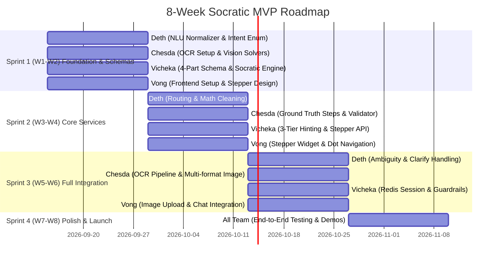

# 🚀 Full MVP Development Roadmap & Team Execution Plan
### Socratic Science & Math AI Chatbot for Elementary Learners (Grades 1–6)

---

## 1. Executive Summary & Team Structure

This document outlines the step-by-step development strategy to take the current Science Chatbot codebase to a **production-ready Full MVP** within an 8-week timeline.

### Team Allocation (4 Team Members)

```
                       ┌──────────────────────────────────────┐
                       │          Project Architecture        │
                       └──────────────────┬───────────────────┘
                                          │
            ┌─────────────────────────────┼─────────────────────────────┐
            │                             │                             │
 ┌──────────────────────┐      ┌──────────────────────┐      ┌──────────────────────┐
 │     DETH (Backend)   │      │    CHESDA (Backend)  │      │   VICHEKA (Backend)  │
 │  NLU & Input Engine  │      │  OCR, Solvers & Vision│     │ Socratic State & Guard│
 └──────────────────────┘      └──────────────────────┘      └──────────────────────┘
            ▲                             ▲                             ▲
            │                             │                             │
            └─────────────────────────────┼─────────────────────────────┘
                                          │
                               ┌──────────────────────┐
                               │    VONG (Frontend)   │
                               │ Stepper UI / UX Web  │
                               └──────────────────────┘
```

| Member | Role | Primary Responsibility | Target Deliverables / File Paths |
| :--- | :--- | :--- | :--- |
| **Deth** | **Backend Engineer (NLU)** | **Natural Language Understanding Pipeline** | `orchestrator/app/services/nlu/`<br>• Text & math symbol normalization<br>• Student intent classification<br>• Ambiguity detection & query clarification |
| **Chesda** | **Backend Engineer (OCR & Solvers)** | **OCR Image Extraction & Domain Solvers** | `orchestrator/app/services/ocr/` + `upload.py`<br>`services/science_service/`, `services/math_service/`<br>• Gemini Vision image/worksheet extraction (`/api/upload/ocr`)<br>• Elementary math & science solvers with step decomposition |
| **Vicheka** | **Backend Engineer (Socratic Engine & Guardrails)** | **LangGraph State Machine, Stepper Core & Guardrails** | `orchestrator/app/services/socratic/`<br>`orchestrator/app/services/guardrails/`<br>• 4-part Socratic response generation (`card_schema.py`)<br>• 3-tier progressive hints & Redis session state<br>• Child safety filter & off-topic deflection |
| **Vong** | **Frontend Engineer (UI/UX)** | **Interactive Stepper Widget & Web Interface** | `frontend/`<br>• Stepper Card Widget with numbered dot navigation<br>• Next/Back buttons + "View all steps" checklist<br>• Photo upload preview & real-time chat UI |

---

## 2. Current Code State vs. Target MVP Gap Analysis

| Component | Current State in Repository | Gap to Full MVP | Assigned To |
| :--- | :--- | :--- | :--- |
| **NLU Pipeline** | Basic intent prompt in `nodes/nlu_pipeline.py` | Missing elementary typo correction, math symbol normalization (e.g. `x` vs `*`, `1/2`), structured intent classification (`INITIAL_SOLVE`, `STEP_ATTEMPT`, `ASKING_HINT`, `CONFUSED`, `CHITCHAT`). | **Deth** |
| **OCR & Vision Solvers** | Placeholder math/science services; no OCR endpoint | Missing Gemini Vision OCR `/api/upload/ocr` for worksheet photos; elementary science/math solvers need step-by-step breakdown generation and verification. | **Chesda** |
| **Socratic Engine & Stepper Core** | Basic turn-taking in `nodes/tutor_loop.py` & `session.py` | Must strictly generate the **4-part Socratic card** (Mission, Clue, Helpful Example, Your Turn), manage active step progression, emit dual JSON/Markdown payloads, and support step-jumping. | **Vicheka** |
| **Safety Guardrails** | Minimal checks in prompt layer | Missing dedicated pre-filter for child safety (PII, inappropriate content) and educational scope deflection (rejecting gaming, gossip, non-homework prompts). | **Vicheka** |
| **Frontend UI** | No web interface exists in the repository | Needs complete kid-friendly web app featuring the **interactive stepper card widget**, numbered dot progress bar, camera/image upload, and responsive layout. | **Vong** |

---

## 3. Individual Work Specifications & Deliverables

---

### 🟢 1. Deth — NLU & Input Engine (Backend)

#### Responsibilities:
1. **Normalizer Module (`orchestrator/app/services/nlu/normalizer.py`)**:
   - Normalize student shorthand, common elementary spelling mistakes, and phonetic typos (e.g., *"subtrak"* $\rightarrow$ *"subtract"*, *"pluse"* $\rightarrow$ *"plus"*).
   - Standardize mathematical notation, fraction formats, exponents, and unit symbols (e.g., `3/4`, `5cm`, `x -> *`).
2. **Intent Classifier (`orchestrator/app/services/nlu/intent.py`)**:
   - Classify student messages into crisp enum categories:
     - `INITIAL_QUESTION`: Student provides a new problem to solve.
     - `STEP_ANSWER_ATTEMPT`: Student is answering the active step's **👉 Your Turn** question.
     - `REQUEST_HINT`: Student asks for a clue or says *"I don't know"*.
     - `REQUEST_CLARIFICATION`: Student is confused about terminology.
     - `NAVIGATION_JUMP`: Student wants to go back or review a previous step.
     - `OFF_TOPIC`: Non-academic query (relayed to Guardrails).
3. **Subject & Grade Level Router (`orchestrator/app/services/nlu/router.py`)**:
   - Classify subject (`math`, `science`) and subtopic (`physics`, `chemistry`, `biology`, `arithmetic`, `word_problem`).
   - Extract numerical parameters and target variables.

#### Key Interface Contract Produced by Deth:
```python
# Output schema passed into Socratic Engine
class NLUResult(BaseModel):
    cleaned_text: str
    intent: Literal["INITIAL_QUESTION", "STEP_ANSWER_ATTEMPT", "REQUEST_HINT", "NAVIGATION_JUMP", "OFF_TOPIC"]
    subject: Literal["math", "science"]
    subtopic: str
    grade_level: str
    extracted_answer: Optional[str] = None
    target_step_index: Optional[int] = None
```

---

### 🟣 2. Chesda — OCR Image Extraction & Domain Solvers (Backend)

#### Responsibilities:
1. **OCR Service Module (`orchestrator/app/services/ocr/extractor.py` & `/api/upload.py`)**:
   - Endpoint `POST /api/upload/ocr` accepting worksheet photos (`.png`, `.jpg`, `.webp`, camera captures).
   - Use Gemini 2.5 Vision to clean, parse, and transcribe handwritten or printed elementary math/science problems into structured text.
2. **Domain Solvers (`services/math_service/` & `services/science_service/`)**:
   - **Math Service**: Solve arithmetic, fractions, word problems; decompose into 3–5 bite-sized verification steps with ground truth answers.
   - **Science Service**: Consolidated biology, chemistry, and physics knowledge engine with step-by-step conceptual reasoning.
   - **Answer Validator**: Check if student attempt is mathematically or conceptually equivalent (e.g. `5 cookies`, `5`, `five` are all recognized as correct for step 2).

#### Key API Contract Produced by Chesda:
```json
{
  "extracted_text": "Leo has 8 cookies. He gives 3 to Sarah. How many cookies does Leo have left?",
  "image_type": "handwritten_worksheet",
  "confidence": 0.98,
  "detected_subject": "math",
  "ground_truth_steps": [
    {"step_number": 1, "action": "identify_given", "values": {"total": 8, "given_away": 3}},
    {"step_number": 2, "action": "subtract", "operation": "8 - 3", "correct_answer": "5"}
  ]
}
```

---

### 🔵 3. Vicheka — Socratic Guidance Engine & Guardrails (Backend)

#### Responsibilities:
1. **4-Part Socratic Card Prompt Controller (`orchestrator/app/services/socratic/prompts/`)**:
   - Structure every pedagogical output strictly into the 4 sections:
     - 🌟 **Our Mission:** `[1 simple sentence defining the step]`
     - 💡 **Clue:** `[Elementary rule/formula from knowledge base]`
     - 🍎 **Helpful Picture / Example:** `> [Visual analogy with objects]`
     - 👉 **Your Turn:** `[Only ONE single question for student]`
2. **Stepper Payload Serializer (`orchestrator/app/services/socratic/card_schema.py`)**:
   - Build Pydantic models for step progression (`total_steps`, `current_step_index`, `completed_steps`, `steps[]`).
3. **LangGraph State Machine & Hint Engine (`orchestrator/app/services/socratic/graph.py`, `hint_engine.py`)**:
   - Manage multi-turn Socratic loop.
   - Implement **3-Tier Progressive Hinting**:
     - *Tier 1 (Guiding Question)*: Points attention to specific clue.
     - *Tier 2 (Worked Analogy)*: Uses parallel visual example (apples, pizza).
     - *Tier 3 (Step Walkthrough)*: Breaks down the calculation without giving final problem answer.
4. **Session Persistence & Guardrails (`orchestrator/app/services/session.py`, `guardrails/`)**:
   - Redis-backed session management with rolling AI summary of previous turns.
   - Child safety filter (PII redaction, inappropriate content blocking).
   - Educational scope deflection (redirecting off-topic chat back to homework).

#### Key Stepper API Payload Produced by Vicheka:
```json
{
  "session_id": "sess_abc123",
  "step_widget": {
    "total_steps": 4,
    "current_step_index": 1,
    "completed_steps": [0],
    "steps": [
      {
        "step_number": 1,
        "title": "Identify given quantities",
        "status": "completed",
        "mission": "Find what numbers we already know.",
        "clue": "Look for numbers in the story.",
        "helpful_example": "Leo has 8 cookies, gives 3 away.",
        "your_turn": "How many cookies did Leo start with?",
        "student_answer": "8"
      },
      {
        "step_number": 2,
        "title": "Subtract given away cookies",
        "status": "in_progress",
        "mission": "Let's subtract the eaten cookies from total!",
        "clue": "Taking away means subtraction.",
        "helpful_example": "🍪🍪🍪🍪🍪🍪 (6) take away 🍪🍪 (2) = 🍪🍪🍪🍪",
        "your_turn": "If Leo had 8 cookies and gave away 3, how many are left?",
        "student_answer": null
      }
    ]
  },
  "formatted_markdown": "🌟 **Our Mission:** Let's subtract the eaten cookies from the total!\n\n💡 **Clue:** Taking away means subtraction.\n\n🍎 **Helpful Picture / Example:**\n> 🍪🍪🍪🍪🍪🍪 (6) take away 🍪🍪 (2) = 🍪🍪🍪🍪\n\n👉 **Your Turn:**\nIf Leo had 8 cookies and gave away 3, how many are left?"
}
```

---

### 🟠 4. Vong — Interactive Stepper UI/UX & Web Client (Frontend)

#### Responsibilities:
1. **Interactive Stepper Widget Component (`frontend/src/components/StepperWidget/`)**:
   - **Active Step Card**: Renders the 4 distinct styled blocks:
     - 🌟 *Mission Badge*
     - 💡 *Clue Card with soft ambient glow*
     - 🍎 *Visual Example Quote Box with emojis and big bold callouts*
     - 👉 *Your Turn Highlight Container*
   - **Numbered Progress Dots**: Clickable bottom dot bar `( 1 )  ● 2 ●  ( 3 )  ( 4 )` with status indicators (completed = green check, active = glowing circle, upcoming = muted circle).
   - **Next / Back Navigation**: Buttons enabling students to step backward to review past steps or proceed forward.
   - **"View all steps" Modal / Drawer**: Checklist view showing all steps and previous student answers at a glance.
2. **Worksheet Image Uploader (`frontend/src/components/ImageUpload/`)**:
   - Drag-and-drop / camera snapshot uploader with instant OCR preview and progress loader.
3. **Chat & Student Response Area (`frontend/src/components/Chat/`)**:
   - Input box tied directly to active step answer submission.
   - Quick action buttons: *"I need a hint 💡"*, *"Explain with pictures 🍎"*, *"Try another problem ✨"*.
4. **Kid-Friendly Aesthetics**:
   - Modern glassmorphism, rounded corners (`border-radius: 16px`), friendly typography (Outfit / Inter / Poppins), smooth spring animations.

---

## 4. 8-Week Implementation Sprint Plan



### Milestone Breakdown:

#### Milestone 1 (Weeks 1–2): Architecture, Contracts & Setup
- **Deth**: Set up `nlu/normalizer.py` and intent classifications with unit tests.
- **Chesda**: Scaffold `/api/upload/ocr` endpoint and consolidate `science_service` & `math_service`.
- **Vicheka**: Define `card_schema.py` and the 4-part prompt templates in `templates.yml`.
- **Vong**: Initialize frontend project (Vite), set up design tokens, color palette, and Stepper component mockup.

#### Milestone 2 (Weeks 3–4): Core Socratic Stepper Pipeline
- **Deth**: Complete intent router for student answer attempts vs hint requests.
- **Chesda**: Implement ground truth step generation and equivalence validator in solver services.
- **Vicheka**: Wire LangGraph state machine to generate dynamic 4-part cards and calculate step indices.
- **Vong**: Implement interactive Stepper Card Widget with clickable dot navigation and Next/Back controls.

#### Milestone 3 (Weeks 5–6): Microservice Integration & Safety
- **Deth**: Connect NLU outputs directly into Socratic graph with typo-resilient parsing.
- **Chesda**: Connect Gemini Vision OCR pipeline with image preprocessing and validation.
- **Vicheka**: Implement Redis session recovery, step-navigation endpoint (`/api/step/navigate`), and deploy child-safety/guardrails.
- **Vong**: Integrate frontend with backend API (`/api/query`, `/api/upload/ocr`, `/api/step/navigate`).

#### Milestone 4 (Weeks 7–8): End-to-End QA, Polishing & Demo
- **All Team**: Test 50+ Grade 1–6 math & science curriculum test cases.
- **Vong**: Micro-animations, responsive tablet/mobile layouts, sound effects / visual celebration confetti on problem completion.
- **Final Deliverable**: Fully containerized Docker Compose deployment ready for live demo.

---

## 5. Architectural Evaluation: Is Task Isolation a Good Approach?

> **Verdict**: **YES, this is the absolute BEST software engineering approach** for a 4-person sprint. In industry software engineering, this pattern is known as **Contract-First Modular Development**.

### Why This Approach Succeeds:
1. 🛡️ **Zero Merge Conflicts**: Because each developer writes code in an isolated directory (e.g. `services/nlu/` vs `services/ocr/` vs `frontend/`), Git will **auto-merge branches without a single conflict**.
2. 🚀 **Zero Blockers (Independent Velocity)**: Deth does not need to wait for Chesda's OCR; Vong does not need to wait for the backend servers to be running; Vicheka can test Socratic logic using mock NLU inputs.
3. 🧪 **Independent Unit Testability**: Each teammate tests their own module in isolation using simple Python fixtures or mock JSON.
4. 🔌 **Plug-and-Play Integration**: When everyone finishes, the integration is merely wiring the pre-defined inputs and outputs in `graph.py` and `endpoints.py`.

---

## 6. Strict Isolation Boundaries & Mock Fixtures Matrix

To guarantee 100% independence, each developer builds against these **Mock Inputs & Outputs**:

| Developer | Isolated Workdir | Mock Input They Use to Develop | Output They Guarantee to Produce | How to Test in Isolation |
| :--- | :--- | :--- | :--- | :--- |
| **Deth** (NLU) | `orchestrator/app/services/nlu/` | Raw text strings with intentional typos: `"i hav 5 apls and gave 2"` | `NLUResult` object (`cleaned_text`, `intent`, `subject`) | Run `pytest tests/test_nlu.py` with 50 raw string test cases |
| **Chesda** (OCR & Solvers) | `orchestrator/app/services/ocr/`<br>`services/science_service/`<br>`services/math_service/` | Test worksheet images from `testing/samples/*.png` & math problem strings | `extracted_text` string + ground truth solution steps | Run `pytest tests/test_ocr.py` & solver HTTP tests on ports 9001/9002 |
| **Vicheka** (Socratic & Guard) | `orchestrator/app/services/socratic/`<br>`orchestrator/app/services/guardrails/` | Hardcoded mock `NLUResult` objects + dummy problem steps | Full 4-part Stepper JSON payload (`card_schema.py`) | Run `python testing/interactive_chat.py` in terminal |
| **Vong** (Frontend) | `frontend/` | Static mock `stepper_response.json` fixture | Interactive Web UI with Stepper Widget | Run `npm run dev` with mock JSON server or local state |

---

## 7. Zero-Conflict Git & Branching Strategy

```text
main (Protected - Production Ready)
 │
 ├── staging (Integration & E2E Testing)
 │    │
 │    ├── feat/nlu-pipeline ────────── (Deth: orchestrator/app/services/nlu/)
 │    ├── feat/ocr-and-solvers ─────── (Chesda: orchestrator/app/services/ocr/ & services/)
 │    ├── feat/socratic-guardrails ─── (Vicheka: orchestrator/app/services/socratic/, guardrails/, session.py)
 │    └── feat/stepper-ui ──────────── (Vong: frontend/)
```

### The 3-Step Merge Protocol:
1. **Step 1 (Branch Delivery)**: Each developer pushes their isolated branch and confirms their isolated unit tests pass 100%.
2. **Step 2 (Staging Assembly)**: Merge branches one-by-one into `staging`. Because file paths are completely disjoint, Git resolves all merges cleanly.
3. **Step 3 (End-to-End Verification)**: Run `docker-compose up --build` on `staging` and execute `testing/test_cases.py`. Once validated, merge `staging` into `main`.

---

## 8. Definition of Done for Final Merge

The full MVP is marked **Ready for Production** when:
1. **Deth**: Student queries with typos and slang are correctly normalized and classified with >95% accuracy in automated test cases.
2. **Chesda**: Uploading a photo of a handwritten elementary worksheet extracts clean question text within 2.5 seconds; domain solvers produce accurate step-by-step decompositions.
3. **Vicheka**: The backend emits valid JSON adhering to `card_schema.py` containing all 4 sections with 0 direct answer leaks; guardrails deflect 100% of inappropriate/off-topic inputs.
4. **Vong**: Stepper widget allows clicking any numbered dot, clicking Next/Back, opening "View all steps", and typing an answer to progress to the next step.
5. **System**: `docker-compose up --build` launches all 4 containers cleanly without manual configuration.
